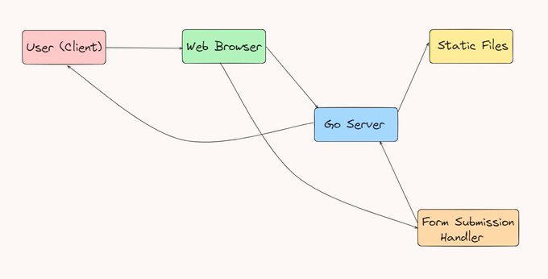

# Go-Server Project

This project is a simple Go-based HTTP server that serves static files and handles form submissions. The server is structured to provide a static website and process user input from a form.

## Project Structure

### Features

- **Static File Serving**: The server serves HTML files from the `./static` folder.
- **Form Submission**: The server handles form submissions at the `/form` endpoint.
- **GET and POST Requests**: Handles GET requests for static files and POST requests for form data.

### How It Works

1. **User Accesses the Website**: When a user accesses the website, the `index.html` file is served.
2. **Form Submission**: Users can submit a form (name and address) via the `/form` route. The server processes the data and sends a response back with the submitted values.

### Running the Server

To run the server:

1. Clone the repository:
    ```bash
    git clone https://github.com/piyushdev04/Go-Server
    cd Go-Server
    ```

2. Run the server:
    ```bash
    go run main.go
    ```

3. Open your browser and navigate to:
    - `http://localhost:8080/` to access the static homepage (`index.html`)
    - `http://localhost:8080/form` to submit a form with name and address.

### Block Diagram

Here’s the block diagram showing the interaction between the user, server, and form submission process:



### Technologies Used

- **Go**: Backend server handling HTTP requests and serving static files.
- **HTML**: Frontend for the static pages and form submission.